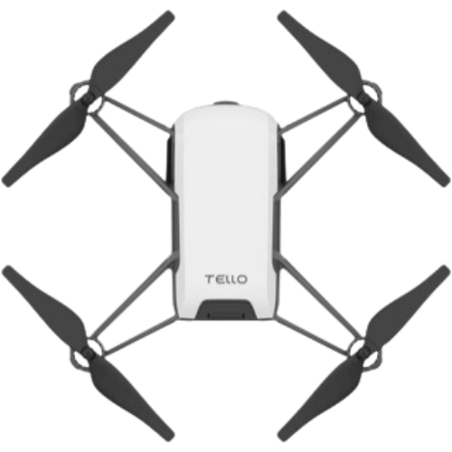

# TelloESP32: An Arduino Library for Controlling DJI Tello Drones with ESP32

[](https://opensource.org/licenses/MIT)



## Overview

**TelloESP32** is a powerful and easy-to-use Arduino library that allows you to control DJI Tello drones using an ESP32 microcontroller. This library provides a comprehensive set of functions for flight control, video streaming, state monitoring, and more. It's designed to be intuitive for beginners while offering advanced features for experienced users.

**Key Features:**

*   **Intuitive API:**  Simple functions for common drone actions (takeoff, land, move, rotate, etc.).
*   **Flight Control:**  Precise control over movement, including advanced maneuvers like flips and curves.
*   **Real-time State Monitoring:** Access drone state information like battery level, height, temperature, and more.
*   **Video Streaming:** Receive and process live video from the Tello's camera.
*   **Mission Pad Support:**  Utilize mission pads for programmed actions and location tracking.
*   **Network Configuration:** Set WiFi credentials and connect to the Tello in different network modes.
*   **Thread-Safe Design:** Uses FreeRTOS tasks and mutexes for safe concurrent operations.
*   **SD Card Recording** Write your video stream to a mounted SD card

**Why use an ESP32?**

*   **Faster Processing:** The ESP32's dual-core processor handles video and data processing more efficiently than standard Arduino boards.
*   **Built-in WiFi:** Simplifies communication with the Tello.
*   **More Memory:** Provides ample space for buffering video and handling drone commands.
*   **FreeRTOS Support:** Enables efficient multitasking, essential for handling video streaming and command processing simultaneously.

**[Picture Idea: Here, add a picture of a Tello drone connected to an ESP32 board. You can also show a screenshot of some sample output from the serial monitor, such as state data or debug messages.]**

## Table of Contents

*   [Overview](#overview)
*   [Key Features](#key-features)
*   [Why use an ESP32](#why-use-an-esp32)
*   [Getting Started](#getting-started)
    *   [Prerequisites](#prerequisites)
    *   [Installation](#installation)
*   [Usage](#usage)
    *   [Basic Connection](#basic-connection)
    *   [Sending Commands](#sending-commands)
    *   [Receiving State Data](#receiving-state-data)
    *   [Video Streaming](#video-streaming)
*   [API Reference](#api-reference)
    *   [Connection and Initialization](#connection-and-initialization)
    *   [Flight Control](#flight-control)
    *   [Movement Commands](#movement-commands)
    *   [Flip Commands](#flip-commands)
    *   [Motor Control](#motor-control)
    *   [Advanced Movement](#advanced-movement)
    *   [Query Commands](#query-commands)
    *   [Direct State Getters](#direct-state-getters)
    *   [Video Configuration](#video-configuration-1)
    *   [Video Streaming](#video-streaming-1)
    *   [Mission Pad](#mission-pad)
    *   [Network Configuration](#network-configuration-1)
    *   [Camera Control](#camera-control-1)
    *   [Expansion Board](#expansion-board)
*   [Examples](#examples)
    *   [Basic Flight](#basic-flight)
    *   [Video Stream and Record](#video-stream-and-record)
*   [Troubleshooting](#troubleshooting)
*   [Contributing](#contributing)
*   [License](#license)

## Getting Started

### Prerequisites

*   **Hardware:**
    *   DJI Tello or Tello EDU drone
    *   ESP32 development board (e.g., ESP32 DevKitC, NodeMCU-32S)
    *   Micro-USB cable to connect the ESP32 to your computer
*   **Software:**
    *   Arduino IDE (latest version recommended)
    *   ESP32 board support in the Arduino IDE (see instructions below)

**Installing ESP32 Board Support in Arduino IDE:**

1. Open the Arduino IDE.
2. Go to **File > Preferences**.
3. In the "Additional Boards Manager URLs" field, enter:
    ```
    https://dl.espressif.com/dl/package_esp32_index.json
    ```
4. Click "OK".
5. Go to **Tools > Board > Boards Manager**.
6. Search for "esp32" and install the "esp32 by Espressif Systems" package.

### Installation

**Using the Arduino Library Manager (Recommended):**

1. Open the Arduino IDE.
2. Go to **Sketch > Include Library > Manage Libraries**.
3. Search for "TelloESP32".
4. Click "Install" on the "TelloESP32 by \[Your Name or Organization]" entry.

**Manual Installation:**

1. Download the latest release of the TelloESP32 library from the [Releases](https://github.com/your-username/TelloESP32/releases) page (replace `your-username` with your GitHub username).
2. Extract the downloaded ZIP file.
3. Rename the extracted folder to "TelloESP32".
4. Move the "TelloESP32" folder to your Arduino libraries directory (usually located at `Documents/Arduino/libraries` on Windows or `~/Documents/Arduino/libraries` on macOS/Linux).
5. Restart the Arduino IDE.

## Usage

### Basic Connection

Here's how to connect to your Tello drone:

```cpp
#include <TelloESP32.h>

using namespace TelloControl;

TelloESP32 tello;

void setup() {
  Serial.begin(115200);

  // Connect to the Tello's WiFi network
  TelloStatus status = tello.connect("TELLO-XXXXXX", ""); // Replace with your Tello's SSID and password if needed

  if (status == TelloStatus::OK) {
    Serial.println("Connected to Tello!");

    // You can start sending commands now
    tello.takeoff();
  } else {
    Serial.print("Error connecting to Tello: ");
    Serial.println((int)status);
  }
}

void loop() {
  // Your main loop code (e.g., reading sensor data, sending RC commands)
}